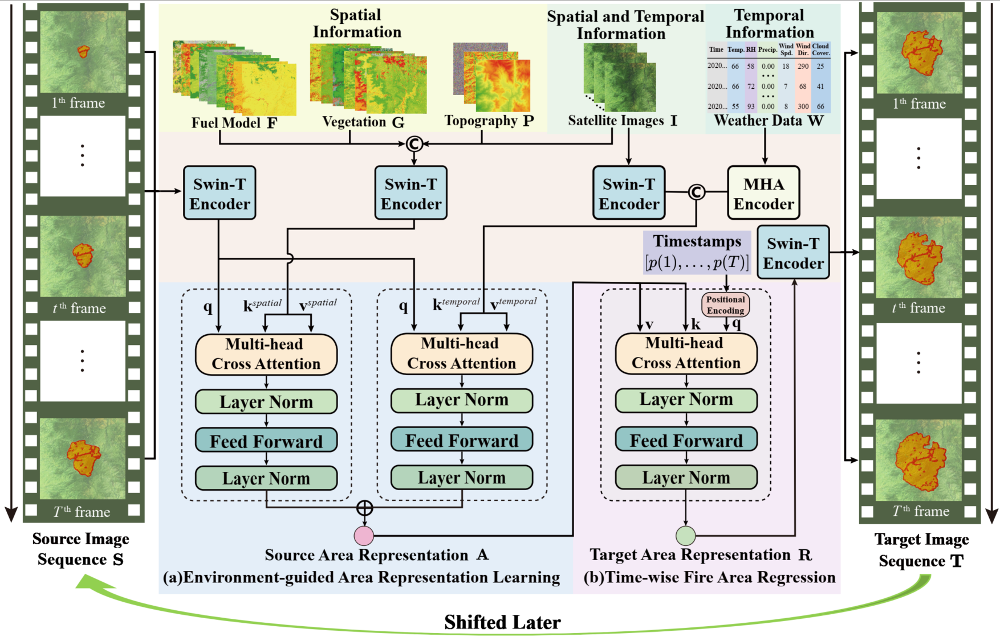
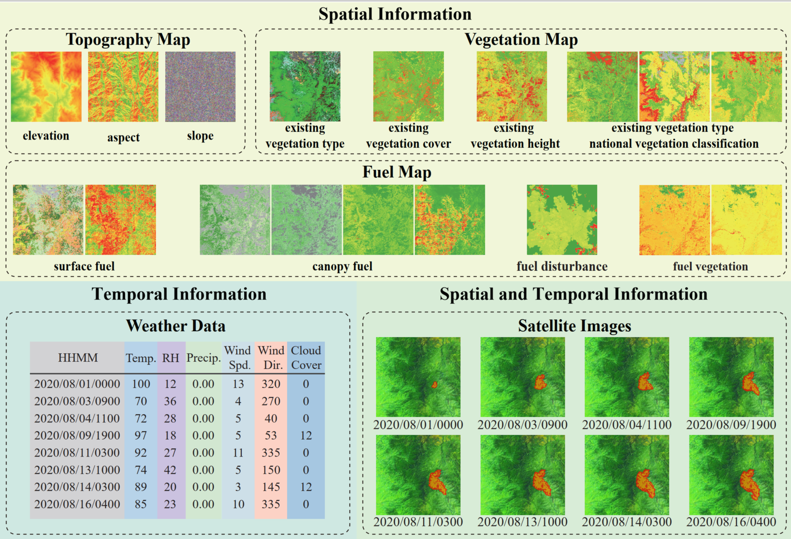
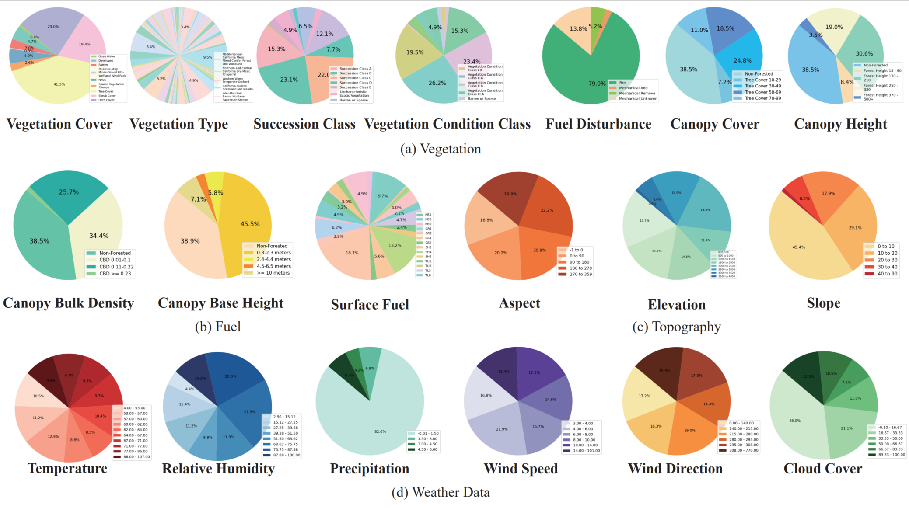

# Sim2Real-Fire

**Sim2Real-Fire: A Multi-modal Simulation Dataset for Forecast and Backtracking of Real-world Forest Fire**

<p align="center">
     
     <br/> S2R-FireTr forecasts wildfires by predicting future target fire areas based on source fire areas. (a) During the environment-guided area representation learning, we input the source fire areas and multi-modal environmental information into the transformer to compute the source area presentation A. (b) During the time-wise fire area regression, we input the source area presentation A and the target timestamp into the transformer to compute the target area presentation R for predicting the target fire areas. "Shifted Later" means that we concatenate the source and target areas to predict later areas. Source and target areas can be interchanged, creating a pipeline for wildfire backtracking.
</p>

## Getting Started

### Sim2Real-Fire Dataset

We create a brand-new **Sim2Real-Fire Dataset** dataset contains wildfire simulation and real-world data, including **1M** and **1K** wildfire scenarios. Each scenario is associated with five data modalities of environmental information, including topography, vegetation, fuel maps, weather data, and satellite images with the annotated fire regions.

We provide a **mini-version** of the dataset in [Sim2Real-Fire](https://1drv.ms/f/s!AhX2uIQNmngrafE5KFjNyZym_7o?e=yo3Q1K)

The examples of satellite images with the real fire areas can be found in the 1.5_Satellite_Images/orignal_images

We will provide the full dataset upon the paper acceptance.

<br>

<p align="center">
  
  <br/> Topography, vegetation, fuel, weather, and the satellite data in the Sim2Real-Fire dataset.
</p>

<br>

<p align="center">
     
     <br/> (a) Distribution of vegetation covers and types. (b) Distribution of fuel types. (c) Distribution topography data. (d) Distribution of weather data.
</p>


### Startup
- **Install dependencies**

```sh
pip install -r requirements.txt
```

### Training

Run the following command to train S2R-FireTr on Simulation dataset. Change the configurations in config.yaml

```sh
python train.py
```

### Testing

Run the following command to test S2R-FireTr on Real-World dataset. Change the configurations in config.yaml

```sh
python test.py
```
